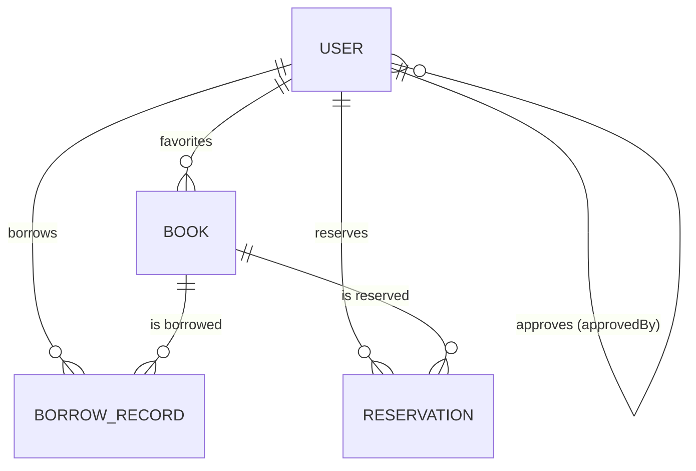

# E-Library Management System

A modular **E-Library Management System** backend built with **Node.js, Express, and MongoDB** — secure JWT authentication, role-based library management, Google Books integration, borrowing/returning with race-condition protection, reservations/waitlists, membership management, favorites, and AI-powered book summaries, plus a built-in browser test console.

> Documentation reflects the **currently implemented** code only. Anything not implemented is marked `In Progress` or `Planned`.

---

## Highlights

- 🔐 JWT authentication with role-based access control (`member` / `librarian`)
- 🗂️ Membership lifecycle — members register as `pending` and must be approved by a librarian
- 📚 Full book CRUD with copy management
- 🔍 Search, filter, sort & paginate the catalog
- ⭐ Favorites (members can favorite/unfavorite books)
- 📖 Google Books integration — search and import external books (librarian)
- 🔄 Borrow/return with atomic copy handling, 14-day loans and overdue fines
- 🎟️ Reservations/waitlist — auto-fulfilled when a copy is returned
- 🤖 AI-powered book summaries with 7-day caching + local fallback
- 🧪 Built-in test console for every endpoint
- 📧 Password reset via transactional email (Gmail OAuth2)

---

## Tech Stack

| Layer | Technology |
|---|---|
| Runtime / Framework | Node.js (ES Modules) + Express 5 |
| Database | MongoDB + Mongoose 9 (ODM) |
| Authentication | JWT (`jsonwebtoken`) |
| Password hashing | `bcrypt` |
| External API | Google Books API (native `fetch`) |
| Email | Gmail API via `googleapis` (OAuth2) |
| AI summaries | OpenAI-compatible chat completions (Userfacet AI) + local fallback |
| Config / Dev | `dotenv` / `nodemon` |

---

## Architecture & Design Approach

Layered architecture:

```
Client → Express App (src/app.js)
          ├─ /api/users, /api/books, /api/borrow, /api/reservations
          └─ static test console (src/public)
→ Auth middleware (verifyJWT) → Role middleware (authorizeRoles)
→ Controllers → Services (business logic, concurrency, external calls)
→ Mongoose Models (User, Book, BorrowRecord, Reservation) → MongoDB
```

- **Routes** declare endpoints and wire middleware/controllers.
- **Middleware** handle JWT verification and role authorization.
- **Controllers** parse/validate requests and shape responses.
- **Services** encapsulate business logic — notably the atomic borrow/return and reservation-queue logic in `borrow.service.js`.
- **Models** define schemas, indexes, and pre-save hooks (e.g. password hashing).
- **Utils** provide shared helpers (`ApiError`, JWT tokens, Gmail mailer).

`src/index.js` connects to MongoDB first, then starts the server on `PORT` (default **8000**).

---

## Getting Started

### Prerequisites

- Node.js v18+ (native `fetch` is used)
- npm, a MongoDB instance (local or Atlas)
- Google Books API key
- *(Optional)* Gmail OAuth2 credentials, AI API token

### Installation & Environment Setup

```bash
git clone https://github.com/RashmiShah06/eLibrary.git
cd eLibrary/backend
npm install
cp .env.example .env   # fill in real values
```

> `.env` is gitignored — never commit real credentials.

### Running the Project

```bash
npm run dev    # development (nodemon)
npm start      # production
```

The server listens on `PORT` (default `8000`).

### Test Console Frontend

The backend serves a browser test console from `src/public/index.html` — no build step. Start the server and open `http://localhost:8000`. Tabs: **Auth**, **Books**, **Google Books**, **Borrowing**, **Reservations**, **Members**. The access token is stored in `localStorage` and attached automatically; a copy-token button is included for Postman testing.

---

## Project Structure

```
backend/
├── .env.example
├── package.json
└── src/
    ├── index.js              # Entry point: connect DB, start server
    ├── app.js                # Express app: JSON, CORS, static, route mounting
    ├── config/               # constants.js, database.js (MONGODB_URI)
    ├── controllers/          # book, borrow, reservation, user
    ├── middleware/           # auth.middleware.js, role.middleware.js
    ├── models/               # book, borrowRecord, reservation, user
    ├── public/index.html     # Test console frontend
    ├── routes/               # book, borrow, reservation, user
    ├── services/             # aiSummary, borrow, googleBooks
    └── utils/                # apiError, mail, tokens
```

---

## Database Models & Relationships

Four Mongoose models, all with `timestamps`.

### User (`User`)

| Field | Type | Notes |
|---|---|---|
| `name` | String | required, 2–100 chars |
| `email` | String | required, **unique**, lowercased |
| `password` | String | required, `select: false`, bcrypt-hashed (10 rounds) |
| `passwordResetToken` / `passwordResetExpires` | String / Date | `select: false`, SHA-256 hash, 15-min expiry |
| `role` | String | `member` \| `librarian`, default `member` |
| `membershipStatus` | String | `pending` \| `active` \| `suspended` \| `rejected`, default `pending` |
| `approvedBy` / `approvedAt` | ObjectId→User / Date | approval metadata |
| `membershipStartDate` / `membershipEndDate` | Date | end date defaults to **+1 year** on approval |
| `rejectionReason` / `suspensionReason` | String | |

### Book (`Book`)

| Field | Type | Notes |
|---|---|---|
| `title` | String | required, indexed |
| `authors` | [String] | required, ≥ 1 |
| `description`, `publisher`, `language` | String | |
| `categories` | [String] | |
| `publishedDate` | String | stored as text (from Google Books) |
| `pageCount` | Number | min 1 |
| `coverImage` / `previewLink` | String | URLs |
| `googleBooksId` | String | unique + sparse (imported books) |
| `totalCopies` / `availableCopies` | Number | total ≥ 1; available 0–total |
| `aiSummary` / `aiSummaryGeneratedAt` | String / Date | cached AI summary |
| `favoritedBy` | [ObjectId→User] | members who favorited |
| `borrowCount` | Number | powers the `popular` sort |

### BorrowRecord (`BorrowRecord`)

| Field | Type | Notes |
|---|---|---|
| `userId` / `bookId` | ObjectId → User / Book | indexed |
| `borrowedAt` / `dueDate` | Date | dueDate = borrowedAt + **14 days** |
| `returnedAt` | Date | default null |
| `status` | String | `active` \| `returned` \| `overdue` |
| `fine` | Number | computed on late return (**5/day**) |

### Reservation (`Reservation`)

| Field | Type | Notes |
|---|---|---|
| `userId` / `bookId` | ObjectId → User / Book | indexed |
| `status` | String | `active` \| `fulfilled` \| `cancelled` |
| `reservedAt` / `fulfilledAt` / `cancelledAt` | Date | |

### Relationships



---

## Authentication & Authorization

1. **Register** / **login** return a single **JWT access token**.
2. Send it as `Authorization: Bearer <token>`.
3. `verifyJWT` middleware decodes it, loads the user, attaches `req.user`; missing/invalid/expired tokens → `401`.

Token payload: `{ id: <userId> }`, expiry `JWT_EXPIRES_IN` (default `7d`).

> **Note:** single access token — **no refresh token / no blacklist**; logout is stateless (client discards the token).

**Password reset:** `forgot-password` generates a token, stores its **SHA-256 hash** (15-min expiry), and emails a reset link built from `FRONTEND_URL`. `reset-password/:token` verifies the hash + expiry and updates the password.

---

## User Roles & Permissions

| Capability | Member | Librarian |
|---|---|---|
| Auth (register/login/logout/profile), password reset | ✅ | ✅ |
| List & search books, book details, AI summary | ✅ | ✅ |
| Favorite / unfavorite books | ✅ | ✅ |
| Borrow & return books | ✅ (active membership) | ✅ |
| Reserve books (waitlist) | ✅ (active membership) | ✅ |
| View own history / reservations | ✅ | ✅ |
| Create / update / delete books | ❌ | ✅ |
| Google Books search & import | ❌ | ✅ |
| List all users / pending members | ❌ | ✅ |
| Approve / reject / suspend memberships | ❌ | ✅ |
| View all borrow records / reservations | ❌ | ✅ |

**Membership workflow:** members register as `pending` → a librarian sets `active` via `PATCH /api/users/:id/membership` (sets `approvedBy`, `approvedAt`, `membershipStartDate`, `membershipEndDate` = +1 year). `rejected`/`suspended` **require a reason**. Borrow eligibility requires `active` membership and unexpired `membershipEndDate` (**librarians always eligible**). Librarian registration requires a `registerKey` matching `LIBRARIAN_REGISTER_KEY`; librarians register as `active`.

---

## Book Management & CRUD

All book management (except reading) is **librarian-only**.

| Operation | Endpoint | Auth |
|---|---|---|
| Create / Update (partial) / Delete | `POST` / `PUT` / `DELETE /api/books[/:id]` | Librarian |
| List books / Get one | `GET /api/books` / `GET /api/books/:id` | JWT |

- **Create** requires `title` + non-empty `authors`; `totalCopies` default `1`, must be a positive integer; `availableCopies` optional (0–total).
- **Update** re-validates `title`, `authors`, `totalCopies`, `availableCopies`.
- **Delete** removes the document. *(Planned: cascade handling of active borrows/reservations.)*
- Imported books carry a unique `googleBooksId`; duplicates → `409`.
- Each serialized book includes computed `favorited` (for the requester) and `favoriteCount`.

---

## Book Search & Pagination

- **Search:** `GET /api/books/search?q=...` — case-insensitive regex over `title`, `authors`, `categories`, `description`; `q` required (`400` if missing); optional `category` filter.
- **List:** `GET /api/books` — query params:

| Query | Values | Default |
|---|---|---|
| `category` | any category | — |
| `sort` | `popular` (borrowCount desc), `title` (asc), `newest` (createdAt desc) | `_id` desc |
| `page` / `limit` | pagination | `1` / `10` |

Responses include `total`, `page`, `limit`.

> **Planned:** MongoDB text indexes / Atlas Search for ranked, typo-tolerant search.

---

## Google Books Integration

Librarian-only, via `src/services/googleBooks.service.js` (native `fetch`):

- **`GET /api/books/google/search?q=...`** — queries the volumes endpoint, `maxResults = 20`, returns raw `items` + `total`.
- **`POST /api/books/google/import/:googleBooksId`** — maps `volumeInfo` into a `Book` (`authors` default `["Unknown"]`; cover prefers `thumbnail`); `totalCopies` from body (default `1`); `409` if the `googleBooksId` already exists (dedupe).

---

## Borrowing & Returning

All endpoints require JWT; borrow/return/reserve are gated by `assertEligibleToBorrow` (active membership for members; librarians always allowed).

**Borrow — `POST /api/borrow/:bookId`**

1. Book must exist (`404`); no existing `active`/`overdue` record for the user (`409`).
2. Atomic conditional update — the last copy can't be double-borrowed:

```js
const updatedBook = await Book.findOneAndUpdate(
  { _id: bookId, availableCopies: { $gt: 0 } },
  { $inc: { availableCopies: -1, borrowCount: 1 } },
  { new: true }
);
```

3. If none available → `409`; otherwise creates a `BorrowRecord` with `dueDate = +14 days`.

**Return — `POST /api/borrow/:bookId/return`**

1. Finds the user's most recent `active`/`overdue` record (`404` if none).
2. Late returns accrue a fine: `5 × days late` (rounded up).
3. Marks `returned`, increments availability **capped at `totalCopies`** via an aggregation-pipeline `$min` update, then processes the reservation queue.

| Rule | Value |
|---|---|
| Loan duration | 14 days |
| Fine | 5 per day overdue (computed on return) |
| Double-borrow | Prevented per user per book |
| Overdue status | Computed lazily when history is listed |

**Views:** `GET /api/borrow/my` (own history, `status`/`page`/`limit`) and `GET /api/borrow` (librarian, all records, populated user + book).

---

## Reservations / Waitlist

Routed under `/api/reservations`. A member joins the **waitlist** for a book with **no available copies**.

- **`POST /api/reservations/:bookId`** — `409` if the book has available copies, the user already has an `active` reservation, or already has an `active`/`overdue` borrow for it.
- **`DELETE /api/reservations/:id`** — cancels the user's **own** reservation; already-fulfilled/cancelled → `400`.
- **Auto-fulfillment:** on each return, `processReservationQueue` finds the **oldest `active` reservation** (FIFO by `reservedAt`), atomically allocates a copy, re-validates the member (eligibility + not already borrowing — otherwise cancels and releases the copy), marks the reservation `fulfilled`, and creates a `BorrowRecord` for that member.
- **Views:** `GET /api/reservations/my` (own, `status`/`page`/`limit`) and `GET /api/reservations` (librarian, all).

> **In Progress:** only **one** reservation is processed per return; the fulfillment path is not transactional end-to-end.

---

## AI-Powered Book Summaries

`GET /api/books/:id/summary` (`src/services/aiSummary.service.js`):

1. **Cache check** — returns the cached `aiSummary` if newer than 7 days (`cached: true`).
2. **Prompt** — built from title, authors, categories, publisher, published date, description.
3. **Provider** — if `AI_API_TOKEN` is set, calls an OpenAI-compatible chat-completions endpoint (Userfacet AI; `AI_API_URL`, default `https://ai-api.userfacet.com/v1/chat/completions`, model `gpt-4o-mini`, `max_tokens: 300`, `temperature: 0.7`).
4. **Local fallback** — if no token is configured, a deterministic summary is built from metadata + description (no network call).
5. Result is saved to the book (`aiSummary`, `aiSummaryGeneratedAt`) and returned with `cached: false`.

> **Note:** the fallback only applies when no `AI_API_TOKEN` is configured; if a token is set but the provider fails, the endpoint returns `500`.

---

## API Reference

All responses are JSON. Protected endpoints require `Authorization: Bearer <accessToken>`.

### Users — `/api/users`

| Method | Endpoint | Auth | Description |
|---|---|---|---|
| POST | `/api/users/register` | Public | `name`, `email`, `password`, optional `role` + `registerKey` (for `librarian`) |
| POST | `/api/users/login` | Public | `email`, `password` → `accessToken` |
| POST | `/api/users/logout` | JWT | Stateless logout |
| GET | `/api/users/profile` | JWT | View own profile |
| POST | `/api/users/forgot-password` | Public | Sends password-reset email (15-min token) |
| POST | `/api/users/reset-password/:token` | Public | Reset password (`password`) |
| GET | `/api/users` | Librarian | List users (`role`, `status`, `search`, `page`, `limit`) |
| GET | `/api/users/pending` | Librarian | Pending member approvals |
| PATCH | `/api/users/:id/membership` | Librarian | Set `status`; `reason` (required for `rejected`/`suspended`), optional `membershipEndDate` |

### Books — `/api/books`

| Method | Endpoint | Auth | Description |
|---|---|---|---|
| GET | `/api/books` | JWT | List (`category`, `sort`, `page`, `limit`) |
| GET | `/api/books/search` | JWT | Search by `q` (+ `category`, `sort`, `page`, `limit`) |
| GET | `/api/books/google/search` | Librarian | External Google Books search (`q`) |
| POST | `/api/books/google/import/:googleBooksId` | Librarian | Import Google Book (optional `totalCopies`) |
| GET | `/api/books/favorites` | JWT | User's favorite books |
| POST / DELETE | `/api/books/:id/favorite` | JWT | Add / remove favorite |
| GET | `/api/books/:id` | JWT | Book detail (incl. `favorited` / `favoriteCount`) |
| GET | `/api/books/:id/summary` | JWT | AI summary (cached 7 days) |
| POST | `/api/books` | Librarian | Create book |
| PUT | `/api/books/:id` | Librarian | Update book (partial) |
| DELETE | `/api/books/:id` | Librarian | Delete book |

### Borrowing — `/api/borrow`

| Method | Endpoint | Auth | Description |
|---|---|---|---|
| POST | `/api/borrow/:bookId` | JWT (eligible member / librarian) | Borrow a copy (atomic, 14-day loan) |
| POST | `/api/borrow/:bookId/return` | JWT | Return a copy (fine if late) |
| GET | `/api/borrow/my` | JWT | Own history (`status`, `page`, `limit`) |
| GET | `/api/borrow` | Librarian | All records |

### Reservations — `/api/reservations`

| Method | Endpoint | Auth | Description |
|---|---|---|---|
| POST | `/api/reservations/:bookId` | JWT (eligible member / librarian) | Reserve a book with no available copies |
| DELETE | `/api/reservations/:id` | JWT | Cancel own reservation |
| GET | `/api/reservations/my` | JWT | Own reservations (`status`, `page`, `limit`) |
| GET | `/api/reservations` | Librarian | All reservations |

---

## Error Handling

- Controllers use try/catch and return JSON errors as `{ "message": "…" }`.
- Service errors use the custom **`ApiError`** (`statusCode` + `isOperational`); borrow/reservation controllers map it to HTTP status.
- Common codes: `400` bad request/validation, `401` unauthenticated, `403` forbidden/ineligible, `404` not found (incl. `CastError`), `409` conflict (duplicate email, already borrowed/reserved, duplicate Google Book, no available copies), `500` server error.
- **No centralized error-handling middleware or 404 handler yet** — each controller manages its own errors.

> **Planned:** global error handler, consistent error envelope, JSON 404 handler.

---

## Testing

- **Automated tests:** none yet (`Planned`); no test script in `package.json`.
- **Manual testing:** the built-in **test console** (`src/public/index.html`) covers all feature groups; tokens can be copied for Postman.

> **Planned:** unit + integration tests (auth, borrow concurrency, reservation fulfillment, service mocking).

---

## Environment Variables

All variables are documented in `.env.example`. Never commit real values — `.env` is gitignored.

| Variable | Required | Default | Purpose |
|---|---|---|---|
| `PORT` | No | `8000` in code (`4000` in `.env.example`) | HTTP port |
| `MONGODB_URI` | Yes | — | MongoDB connection string (**must include DB name**) |
| `JWT_SECRET` | Yes | — | JWT signing secret |
| `JWT_EXPIRES_IN` | No | `7d` | Access-token lifetime |
| `LIBRARIAN_REGISTER_KEY` | For librarian registration | — | Key required to register as librarian |
| `FRONTEND_URL` | No | `http://localhost:5173` | Base URL in password-reset emails |
| `EMAIL_USER` | Password reset | — | Gmail sender |
| `GOOGLE_CLIENT_ID` / `GOOGLE_CLIENT_SECRET` / `GOOGLE_REFRESH_TOKEN` | Password reset | — | Gmail OAuth2 credentials |
| `GOOGLE_BOOKS_API_KEY` | Google Books | — | Google Books API key |
| `AI_API_TOKEN` | No | — | AI provider token; **absent → local fallback** |
| `AI_API_URL` | No | `https://ai-api.userfacet.com/v1/chat/completions` | OpenAI-compatible URL |

---

## Security Considerations

**Implemented:** bcrypt hashing (10 rounds) with `select: false` passwords; JWT access tokens verified per route; role middleware for librarian endpoints; `LIBRARIAN_REGISTER_KEY` for librarian accounts; SHA-256-hashed reset tokens with 15-min expiry; safe query building; `.env` gitignored.

**To tighten:** CORS is `Access-Control-Allow-Origin: *` (lock to real frontend for production); `forgot-password` reveals whether an email exists (`404` → user enumeration); email-send failure during `forgot-password` persists the token but returns `500`; no rate limiting on auth; no refresh tokens/blacklist (logout is client-side).

---

## Current Implementation Status

| Feature | Status |
|---|---|
| Registration / login / profile / logout | ✅ Implemented |
| Password reset (email + token) | ✅ Implemented |
| Membership approval workflow | ✅ Implemented |
| User list / pending / status updates | ✅ Implemented |
| Book CRUD | ✅ Implemented |
| Book search, filter, sort, pagination | ✅ Implemented |
| Favorites | ✅ Implemented |
| Google Books search + import | ✅ Implemented |
| Borrow / return with atomic copies | ✅ Implemented |
| Overdue tracking (lazy) | ✅ Implemented |
| Reservations / waitlist + auto-fulfillment | ✅ Implemented |
| AI book summaries (+ cache + fallback) | ✅ Implemented |
| Test console frontend | ✅ Implemented |
| Automated tests | ❌ Planned |
| Global error handler / 404 handler | ❌ Planned |
| Rate limiting | ❌ Planned |
| Refresh tokens / token revocation | ❌ Planned |

---

## Future Improvements

- Global error handler + consistent response envelope
- Automated tests (auth, borrow concurrency, reservation queue)
- Rate limiting on auth / external-API routes
- Refresh-token rotation + server-side invalidation
- Production CORS, security headers (`helmet`), request logging (`morgan`)
- Scheduled overdue job + due-date/fine reminder emails
- Transactional reservation fulfillment (mongoose sessions)
- MongoDB text index / Atlas Search
- Cascading cleanup when a book is deleted
- Pagination for favorites
- Input-validation library (Joi/Zod)
- Docker + CI pipeline
- Email verification on registration

---

## Important Design Decisions & Assumptions

1. **Two roles only** — `member` and `librarian`; librarians manage users, books, memberships.
2. **Membership is approval-gated** — new members can't borrow until a librarian activates them (`pending → active`).
3. **Librarians bypass membership checks** — register as `active`, always eligible to borrow.
4. **Single access token, no refresh tokens** — simpler client flow; no server-side logout/revocation.
5. **Atomic copy allocation** — conditional `findOneAndUpdate` (`availableCopies > 0`) prevents oversubscribing the last copy under concurrency.
6. **Availability capped on return** — pipeline `$min` update prevents `availableCopies` exceeding `totalCopies`.
7. **Loan constants hardcoded** — 14-day loans and 5/day fine in `borrow.service.js` (`LOAN_DURATION_DAYS`, `FINE_PER_DAY`).
8. **Lazy overdue marking** — derived when records are listed, not by a background job; fines computed at return.
9. **Reservation FIFO queue** — oldest `active` reservation fulfilled per return; re-validated (eligibility + not already borrowing); one reservation per return event.
10. **Google Books as enrichment source** — `publishedDate` kept as string; `authors` default `["Unknown"]`; dedupe on `googleBooksId`.
11. **AI summaries optional & cached** — works without `AI_API_TOKEN` via local fallback; cached 7 days to avoid repeat API cost.
12. **DB name in connection string** — `MONGODB_URI` is used verbatim (must include DB name); the `DB_NAME` constant in `constants.js` is **not** wired into the connection.
13. **Default port 8000** in code (`.env.example` ships `PORT=4000`) — keep consistent in your tooling.

---

## Author & License

- **Author:** Rashmi Shah · **Repo:** [github.com/RashmiShah06/eLibrary](https://github.com/RashmiShah06/eLibrary) · **License:** ISC
